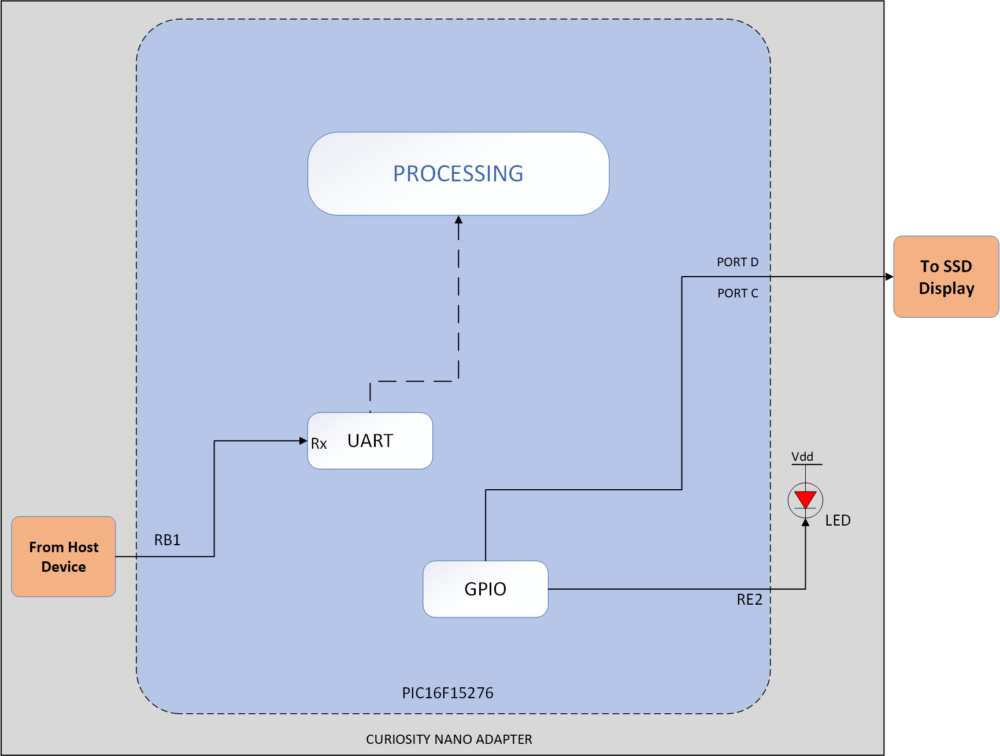
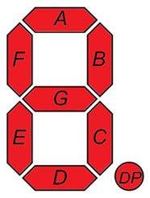
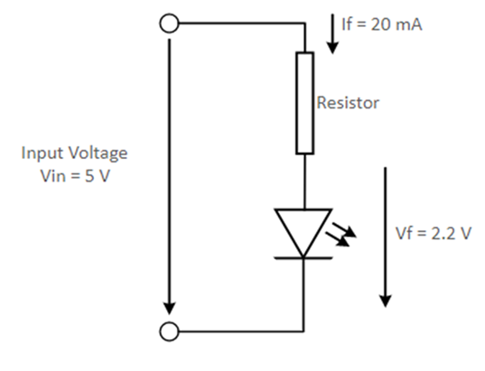
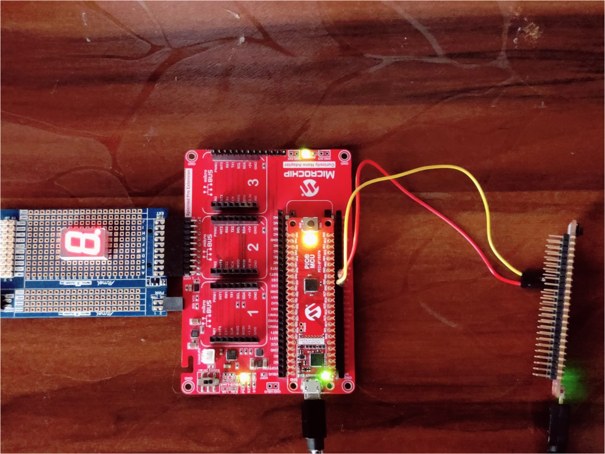
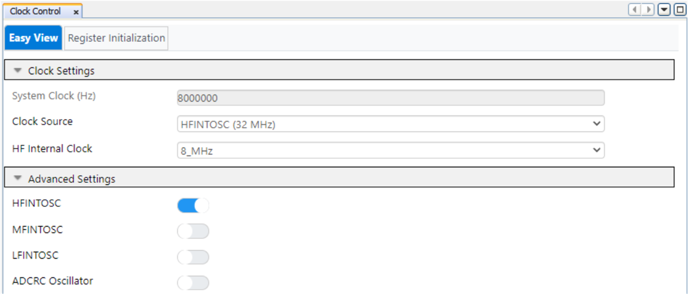
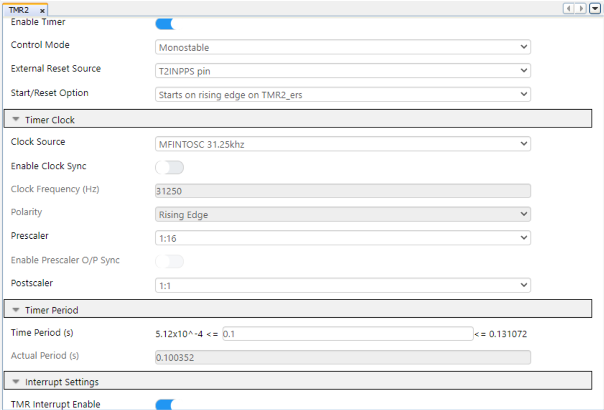
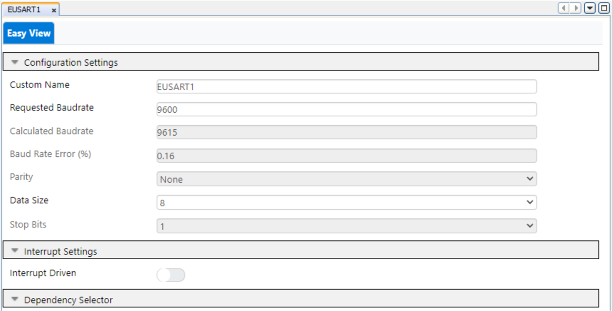
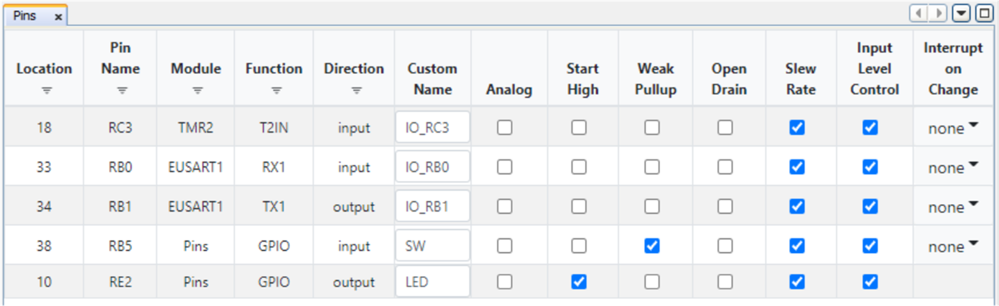
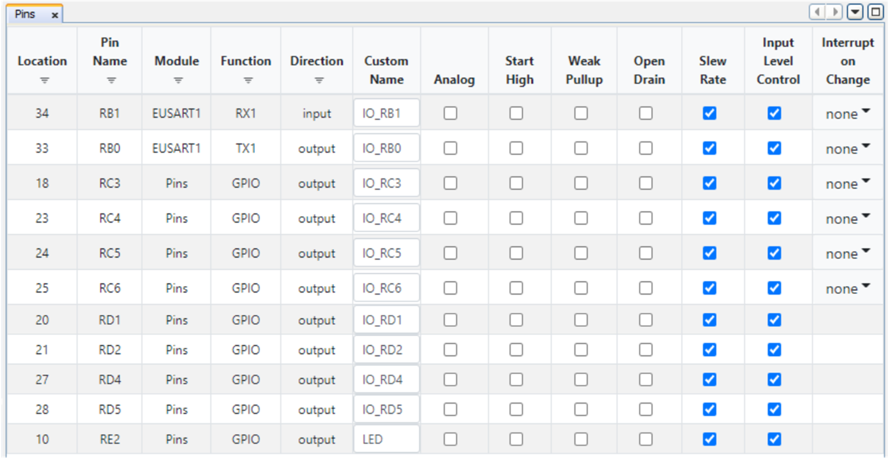

<!-- Please do not change this logo with link -->

# UART I/O Expander: Host Implementation using PIC16F15276

This code example demonstrates usage of PIC16F15276 microcontroller as a I/O expander in embedded applications, where the PIC16F15276 microcontroller provides additional I/O pins to the main microcontroller through serial communication interface like I2C or SPI or UART. In this code example, use of EUSART peripheral and GPIOs to realize UART I/O expander is demonstrated.

## Introduction

The PIC16F152xx family of microcontrollers are available in packages for various embedded applications. The PIC16F15276 simplified feature set includes Peripheral Pin Select (PPS), digital communication peripherals, timers, Enhanced Universal Synchronous Asynchronous Receiver Transmitter (EUSART). In real time applications, EUSART, can be configured as a full-duplex asynchronous system or half-duplex synchronous system. Full-Duplex mode is useful for communications with peripheral systems, such as CRT terminals and personal computers. Half-Duplex Synchronous mode is intended for communications with peripheral devices, such as A/D or D/A integrated circuits, serial EEPROMs or other microcontrollers. Several embedded applications use I/O expander to add the additional I/O pins required for the main microcontroller while interfacing standalone IC modules, display modules, for various features implementation. This code example demonstrates implementation of I/O Expander using EUSART peripheral and I/O pins of the PIC16F15276 microcontroller.

Refer code example [UART I/O Expander: Client Implementation using PIC16F15276](https://github.com/microchip-pic-avr-examples/pic16f15276-cnano-uart-io-expander-client-mplab-mcc.git) for more details about the client device implementation.

## Related Documentation

- [PIC16F15276 Product Page](https://www.microchip.com/en-us/product/PIC16F15276)
- [PIC16F152xx MCU Family Product Brief](https://ww1.microchip.com/downloads/en/DeviceDoc/40002140A.pdf)
- [How to use PIC16F15244 Family as an I/O Expander](https://www.microchip.com/en-us/about/blog/design-corner/how-to-use-the-pic16f15244-family-as-an-i-o-expander-for-more-de1)
- [SPI I/O Expander using PIC16F15276 micrcocontroller](https://github.com/microchip-pic-avr-examples/pic16f15276-cnano-spi-io-expander-host-mplab-mcc.git)
- [PIC16F15244 Code Examples on GitHub](https://github.com/microchip-pic-avr-examples)
- [PIC16F152xx MCU Family Video](https://youtu.be/nHLv3Th-o-s)

## Description

In this code example, host microcontroller expects to display the numbers on Seven Segment Display (SSD). To interface SSD with the host device, it requires minimum 7 general purpose I/O pins. To minimize the usage of I/O pins on host, a secondary microcontroller is used as client for driving the SSD and, UART serial communication interface is used for communication between both the host and client devices. To establish communication between host device and client device UART serial communication interface is used.

For the ease of demonstration, this code example uses PIC16F15276 microcontroller as host microcontroller and another PIC16F15276 microcontroller as client microcontroller. Also, the code example uses PIC16F15276 Curiosity nano development boards for the demonstration.

On host device, on-board switch of the PIC16F15276 Curiosity Nano board is used to send command to the client device through UART interface. The on-board LED is used to notify the user about successful switch press event detection and subsequent UART command transmission by the host. After receiving the command from host, client device drives the respective I/O pins connected to the SSD in a pre-defined sequence, to display numbers from 0 to 9 in the ascending order.

  
   Figure 1: Block Diagram  

- In this example, PIC16F15276 CNANO boards, PROTO Xplained Pro extension kit with SSD circuitry populated over it and few connecting jumper cables are used for demonstrating UART I/O Expander.
- The on-board switch of host device is used to initiate the communication between the host and client devices over UART interface. The HLT mode of timer2 module is used for switch debounce implementation.
- The client receives the command from the host device over UART interface.
- The client microcontroller verifies the commands upon reception, if it matches then initiates the number display from 0 to 9 on SSD. It is followed up with SSD value resetting to zero.

# Seven Segment Display(SSD)

The 7-segment display consists of seven LEDs arranged in a rectangular fashion. Each of the seven LEDs is called a segment because when illuminated the segment forms part of a numerical to be displayed.

An additional 8th LED is sometimes used within the same package thus allowing the indication of a decimal point, (DP) when two or more 7-segment displays are connected to display numbers greater than ten.

Each one of the seven LEDs in the display is given a positional segment with one of its connection pins being brought straight out of the rectangular plastic package. These individual LED pins are labelled from a through to g representing each individual LED. The other LED pins are connected and wired to form a common pin. An additional 8th LED is sometimes used within the same package thus allowing the indication of a decimal point, (DP) when two or more 7-segment displays are connected to display numbers greater than ten.

  
   Figure 2: SSD Segment Naming Conventions  

Seven Segment Hex values:

|Number|HGFEDCBA|Hexadecimal|
|:---------:|:----------:|:----------:|
| 0 | 11000000 | 0xC0 |
| 1 | 11111001 | 0xF9 |
| 2 | 10100100 | 0xA4 |
| 3 | 10110000 | 0xB0 |
| 4 | 10011001 | 0x99 |
| 5 | 10010010 | 0x92 |
| 6 | 10000010 | 0x82 |
| 7 | 11111000 | 0xF8 |
| 8 | 10000000 | 0x80 |
| 9 | 10010000 | 0x90 |

**Resistor Value Calculations**

If forward current (If) is 20 mA
If forward voltage (Vf) is 2.2 V
Input voltage (Vin) is 5V

Resistor ( R ) = (Vin – Vf ) / ( If ) = 140 ohms

***Note: 330 or 470 ohms resistor will be used.***

  
   Figure 3: SSD LED Resistor Driver Circuit  

## Software Used

Microchip’s free IDE, compiler and graphical code generators are used throughout the application firmware development. Following are the tools used for this demo application:

* MPLAB® X IDE [v6.00.0 or newer](https://www.microchip.com/mplab/mplab-x-ide)
* XC8 Compiler [v2.36.0 or newer](https://www.microchip.com/mplab/compilers)
* MPLAB Code Configurator (MCC) [v5.0.3](https://www.microchip.com/mplab/mplab-code-configurator)
* UART MCC Melody driver 1.6.0
* Microchip PIC16F1xxxx Series Device Support [1.9.163 or newer](https://packs.download.microchip.com/)

***Note: For running the demo, the installed tool versions should be the same or later. This example is not tested with the previous versions.***

## Hardware Used

* [PIC16F15244 Curiosity Nano](https://www.microchip.com/en-us/product/PIC16F15244 "PIC16F15244 Curiosity Nano")
* [Curiosity Nano Base for Click boards](https://www.microchip.com/developmenttools/ProductDetails/AC164162 "Curiosity Nano Base for Click boards")
* [PROTO Xplained Pro Extension Kit](https://www.microchip.com/en-us/development-tool/ATPROTO1-XPRO "PROTO Xplained Pro Extension Kit")
* Seven Segment Display

## Application Firmware

This example is supplemented with two standalone firmware named as host firmware, client firmware.

The host firmware uses EUSART peripheral for communication with client. Upon detection of a valid switch press event, the host sends a command to the client over UART interface. Also, the host blinks on-board LED each time a command is successfully sent to the client.

The client firmware is comprised of two sections. First section is verifying the command received from the host through UART interface. The second section consists of driving SSD, so the SSD start displaying digits from 0 to 9 in an incrementing order each time a valid command is received from the host. Additionally, the client firmware toggles on-board LED each time after a digit is displayed on the SSD and resets display value to zero when the cycle is completed.

## Hardware Setup

The following figure consists of populated PROTO Xplained Pro extension kit, Curiosity Nano Adapter Board and PIC16F15276 Curiosity Nano Evaluation Kit (host and client devices). The figure shows the detailed information about the hardware setup. The populated PROTO Xplained Pro extension kit is interfaced with PIC16F15276 microcontroller using extension header.

  
   Figure 4: Hardware Setup  

## Operation

* Make the hardware connections as shown in the Hardware Setup. Power up the Curiosity Nano board using micro-USB cable.
* Download the firmware available from the GitHub code example page.
* Build the project using latest version of tools as mentioned in the Software Tools section and flash the generated file on the PIC16F15276 microcontroller.
* On host-side, onboard switch press event is performed to transmit the command to the client through EUSART interface.
* On host-side, onboard LED is used as an indicator for the switch press event and indicates command is sent to the client.
* On client-side, after receiving the command from the host, client device verifies the command and drives the 7 segment LED display to display numbers from 0 to 9. On-board LED of CNANO board toggles for every number display.

## Conclusion

In many real-world embedded applications, the microcontroller requires to interface with multi-pin standalone IC modules and display units to perform various functionalities. So, the developers have a challenge in effectively using microcontrollers I/O pins for interfacing the external modules without opting an expensive, higher pin and memory variant. This code example demonstrates how cost effective and entry level PIC16F15726 microcontroller can be used as I/O expander using UART interface.

## Appendix

MCC – MPLAB® Code Configurator is a graphical programming environment that generates seamless, easy to understand C code to give a head start to the project, saving the designer’s time to initialize and configure all the modules, and to go through the datasheets. Using an instructive interface, it enables and configures all peripherals and functions specific to the application requirements.

**Start by creating a new Project and open MCC**
- Go to File > New Project
- Select Microchip Embedded > Standalone Project
- Enter the device name. In this case, select PIC16F15276 device
- Name the project
- Launch MCC tool by navigating to ***“Tools -> Embedded -> MPLAB Code Configurator v4: Open/Close”*** . Alternatively, click the MCC icon to launch the MCC tool.

## System Configuration

- Configure Clock

  Open "Clock Control" setup present under "System" dropdown menu in "Project Resources" tab. Host and the client device will be configured with same configuration as given below.

  Set "Clock Source" as "HFINTOSC"
-- Set "HF Internal Clock" as "8_MHz"
-- Enable low power programming checkbox

The system configuration window of MCC is used for MCU oscillator, Watchdog timer and low voltage programming configuration. The Watchdog timer is disabled in the application.

The following figure shows the system configuration setting in MCC tool.

  
   Figure 5: Clock Configuration  

- Timer 2 Configuration

Configure Timer2 in HLT mode for switch debouncing functionality with the following configuration.

-- Enable Timer checkbox
-- Control Mode – Monostable
-- Ext Reset – T2INPPS
-- Start/Reset Option – Start on rising edge on TMR2_ers
-- Clock Source – MFINTOSC 31.25kHz
-- Polarity – Rising Edge
-- Prescaler – 1:16, Postscaler – 1:1
-- Time Period – 100ms 
-- Enable Timer Interrupt checkbox

  
   Figure 6: Timer 2 Configuration  

- EUSART Configuration

  
   Figure 7: EUSART Configuration  

## Pin Mapping

The following images informs about the pin usage in the project.

1. Host Device

  
   Figure 8: Pin Configuration (Host)  

2. Client Device

  
   Figure 9: Pin Configuration (Client)  

